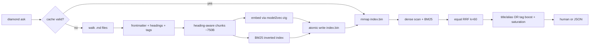

# Diamond: Obsidian vault semantic search

## Verdict after review

Draft was Semble-shaped but overbuilt for vaults. [gpt-5.6 sol simplifier](83bd1a5c-93aa-45ad-aa2d-917f4d1aedfb) cut graph resolution, adaptive α, subjective penalties, extra CLI commands, fragmented persistence, and a custom embedding port. What remains is the smallest design that still keeps speed, CPU-only, hybrid ranking/blending, and Obsidian-native signals.

## Goal

```text
diamond ask --vault PATH QUERY [--top-k N] [--json]
```

Returns the most relevant original Markdown chunks from an English Obsidian vault — vault-relative path, heading breadcrumb, source lines — entirely offline. Interactive-fast.

## Non-goals (v1)

- No LLM answers, plugin UI, multi-vault, remote fetch
- No wiki-link graph / backlink ranking (links stay as searchable text only)
- No HNSW / ANN abstraction — exact dense scan
- No incremental indexing — full rebuild when stale
- No `.gitignore` / Obsidian exclude-files reading
- No Windows release first (macOS arm64/x86_64 + Linux x86_64)
- No ranking knobs exposed as CLI flags

## What we keep from Semble

| Semble idea | Diamond form |
|-------------|--------------|
| Hybrid dense + sparse | Model2Vec + BM25 |
| RRF fusion | Equal-weight RRF, `k=60` (no adaptive α — code-symbol α does not transfer) |
| Ranking / blending | Title/alias boost, `#tag` boost, note saturation |
| Disk cache + mtime invalidation | `manifest.json` + atomic `index.bin` rebuild |
| Static embeddings, CPU | Pinned `model2vec-zig` + `potion-base-8M` i8 `@embedFile` |
| Fast queries | Brute-force normalized dot product over chunk vectors |

## Architecture



## CLI

- `--vault` required; canonicalize path
- `QUERY` one non-empty positional
- `--top-k` default `5`, range `1..50`
- First use / stale cache: rebuild; reason + elapsed time on stderr
- Exit: `0` empty or success, `1` runtime failure, `2` bad args
- Human output: path, heading trail, lines, snippet — **no score** (RRF is uncalibrated)
- JSON: include `score` documented as uncalibrated rank score

## Indexing

1. **Walk** — recursive `*.md` (case-fold), skip `.obsidian/`, `.trash/`, `.git/`, `node_modules/`; no symlink follow; sort paths for determinism; fail on bad UTF-8 / files >16 MiB
2. **Parse** — initial `---` frontmatter only; extract `title` / `aliases` / `tags` (scalar, block list, flow list); unsupported forms for those fields **abort with path+line**; ignore other keys; ATX headings; inline `#tags` outside fences/inline code; wiki-links left as raw text
3. **Chunk** — never cross ATX heading; target 750 UTF-8 bytes (hard max 1000); prefer blank-line then newline then UTF-8-safe split; merge trailing &lt;250B into predecessor if ≤1000; store note id, breadcrumb, body, inclusive lines
4. **Retrieval text**
   - Dense: note name + title + aliases + H1 + breadcrumb + body
   - Sparse via repetition: body×1, parent folder×1, breadcrumb×2, name/title/H1/aliases×3, tags×3
5. **Build** — sequential embed → normalized 256-d `f32`; BM25 (`k1=1.2`, `b=0.75`, standard IDF); no stemming/stopwords

## Search / ranking

1. Over-fetch: `min(chunk_count, max(50, top_k*10))` from each retriever
2. Fuse: `1/(60+dense_rank) + 1/(60+bm25_rank)` (missing = 0)
3. One mutually exclusive boost: exact note-name/title/H1/alias match `×1.50`, else explicit `#tag` match `×1.25`, else `×1.00`
4. Greedy select with note saturation `0.5^n` after first hit from a note
5. Tie-break: path, then start line

No further heuristics until a labeled vault eval proves lift.

## Persistence

- macOS: `~/Library/Caches/diamond/<sha256(canonical_vault)>/`
- Linux: `$XDG_CACHE_HOME/diamond/` or `~/.cache/diamond/`
- Files: `manifest.json` (schema, model hashes, file snapshot `{path,size,mtime_ns}`, counts) + mmap-ready `index.bin` (strings, notes, chunks, BM25, vectors)
- Advisory lock; build to temp dir; atomic rename; never serve stale on rebuild failure; full rebuild only

## Zig layout

```text
build.zig / build.zig.zon
src/
  main.zig      # CLI, output
  vault.zig     # walk, parse, chunk
  embed.zig     # model2vec asset + search-text construction
  bm25.zig      # tokenize, inverted index, score
  index.zig     # types, build, encode/validate, cache lifecycle
  search.zig    # dense scan, RRF, boosts, saturation
assets/potion-base-8M/  # tokenizer.json, model.i8.safetensors, LICENSE
tests/cli.zig
```

## Embedding (committed)

- Zig **0.16.0**
- Pin [`PaytonWebber/model2vec-zig`](https://github.com/PaytonWebber/model2vec-zig) **v0.2.0** (verified: pure Zig Model2Vec, MIT)
- Model: [`minishlab/potion-base-8M`](https://huggingface.co/minishlab/potion-base-8M) (MIT, 256-d)
- Reference-compatible **i8** safetensors; `@embedFile` tokenizer + weights into the binary
- No ONNX, no llama.cpp, no runtime download, no network at query time
- Store full asset SHA-256 in manifest (not just library fingerprint)
- Risk note: model2vec-zig is young — pin by hash; treat upgrades as deliberate

## Acceptance (must pass before calling v1 done)

**Correctness:** golden parser fixtures; BM25 hand fixtures; embedding parity vs Python Model2Vec i8 within `1e-5`; deterministic ranking; cache invalidation/corruption/concurrency tests; JSON anchors match source lines.

**Retrieval:** ≥3 real English vaults, ≥100 labeled queries (named-note, alias, tag, keyword, paraphrase, cross-heading). Hybrid nDCG@10 ≥ better of BM25-only / dense-only; paraphrase Recall@5 ≥ dense-only; named-note/alias/tag → relevant note in top-3 ≥95%. Account for every regression vs component baselines.

**Perf** (`ReleaseFast`, top-k=5 JSON, warm FS cache, includes startup+validation+search):
- 1k notes / ≤10k chunks: cold index &lt;2s; warm ask p50 &lt;20ms, p95 &lt;50ms
- 10k notes / ≤100k chunks: warm ask p50 &lt;100ms; peak RSS &lt;250 MiB
- Zero network; succeeds offline

## Implementation order (after plan approval)

1. Scaffold Zig project + pin model2vec-zig + embed potion i8 asset
2. Vault walk/parse/chunk + golden fixtures
3. BM25 + dense index build + `index.bin` / manifest / lock
4. Hybrid search + boosts/saturation + CLI output
5. Eval corpus + baselines; only then consider any ranking expansion
6. Release binaries (macOS/Linux)

## Explicit cuts from the first draft

Wiki-link graph, adaptive α, coherence/daily/template/excalidraw penalties, `diamond index`/`status`, HNSW, custom Model2Vec port, fragmented multi-file store, `.gitignore` handling, Windows v1.